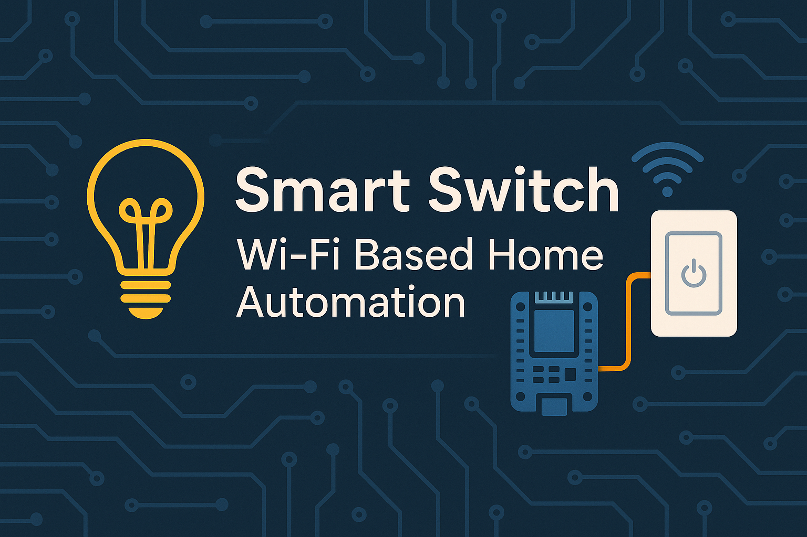

# 🔌 **  Smart  Switch  –  Wi-Fi Based Home Automation**

<p align="center">
  
</p>

<p align="center">
  <b>Control any electrical device remotely using ESP8266/ESP32 over Wi-Fi</b><br>
  Simple • Fast • Low Cost • DIY Friendly
</p>

---

## 📛 **Badges**

<p align="center">


</p>

---

# ⭐ **Overview**

**Smart Switch** is a low-cost IoT home automation system built using **ESP8266/ESP32 + Relay module**.
It allows you to control any AC appliance (lamp, fan, charger, etc.) directly from a **web browser** on your local Wi-Fi network.

No app required.
No cloud required.
Just your router + ESP board.

---

# 🚀 **Features**

* 🌐 Control from any phone/PC on same Wi-Fi
* ⚡ Turns ON/OFF any AC appliance
* 🧠 Built-in Web Server
* 🪶 Lightweight and fast interface
* 🔌 Supports ESP8266 & ESP32 both
* 💸 Very low cost (under ₹200–₹300 hardware)
* 🛠️ Perfect for DIY automation projects

---

# 📦 **Bill of Materials (BOM)**

| Component                 | Qty      | Description            |
| ------------------------- | -------- | ---------------------- |
| ESP8266 (NodeMCU) / ESP32 | 1        | Wi-Fi microcontroller  |
| Relay Module 5V / 3.3V    | 1        | For switching AC load  |
| 5V Power Adapter          | 1        | For powering the board |
| Jumper Wires              | —        | Connections            |
| Electrical Appliance      | 1        | Lamp/Fan etc.          |
| Breadboard/Case           | Optional | For enclosure          |

---

# ⚙️ **How It Works (Working Principle)**

1. ESP board connects to your home Wi-Fi
2. It hosts a **local web server**
3. User opens the webpage → clicks ON/OFF
4. ESP toggles GPIO pin
5. Relay switches the AC appliance

**Flow:**
**Browser → ESP → GPIO → Relay → Appliance**

---

# 🔗 **Circuit Diagram**

### **ASCII Diagram (copy-safe)**

```
          +------------------------+
          |       ESP8266         |
          |                        |
          |   GPIO D1 -----> Relay IN
          |   3.3V  -------> Relay VCC
          |   GND   -------> Relay GND
          +------------------------+

                    +---------+
AC Live  -----------| Relay   |------> Appliance
AC Neutral --------------------------> Appliance
                    +---------+
```

### **Image Placeholder**

```
images/circuit_diagram.png
```


# 🔄 **Flowchart**

```
        +--------------------+
        | Power On ESP8266   |
        +---------+----------+
                  |
                  v
        +---------+----------+
        | Connect to Wi-Fi   |
        +---------+----------+
                  |
                  v
        +---------+----------+
        | Start Web Server   |
        +---------+----------+
                  |
                  v
        +--------------------+
        | User Opens Web UI |
        +---------+----------+
                  |
                  v
        +--------------------+
        | User Clicks ON/OFF |
        +---------+----------+
                  |
        +---------v----------+
        | Toggle GPIO Output |
        +---------+----------+
                  |
                  v
        +--------------------+
        | Relay Switches Load |
        +--------------------+
```

---

# 📁 **Project Directory Structure**

```
Smart_Switch/
│── src/
│   └── smart_switch.ino
│── images/
│   ├── circuit_diagram.png
│   ├── web_ui.png
│   └── banner.png
│── docs/
│── LICENSE
│── README.md
```

---

# 🛠️ **Setup Instructions**

### **1️⃣ Install Arduino IDE**

Download from official site.

### **2️⃣ Install Board Packages**

* ESP8266 by ESP8266 Community
* ESP32 by Espressif Systems

### **3️⃣ Install Libraries**

No external libraries needed unless you add MQTT.

### **4️⃣ Upload Code**

Select correct COM port → Upload.

### **5️⃣ Check Serial Monitor**

You will see ESP IP address.

### **6️⃣ Open Browser**

Enter:

```
http://<ESP-IP-Address>
```

### **7️⃣ Control Appliance**

Click **ON** / **OFF** buttons.

---

# 📸 **Demo Screenshots**

```
images/web-ui.png
```

# 🔮 **Upcoming Improvements**

* 📱 Mobile responsive UI
* 🏠 Home Assistant / MQTT integration
* 🗣️ Alexa & Google Assistant control
* 🌐 Cloud access (optional)
* 🔄 Real-time feedback (device status)
* 🔥 Touch switch + physical button mode

---

# 📘 **License**

MIT License – free to use, modify, and distribute.

---
